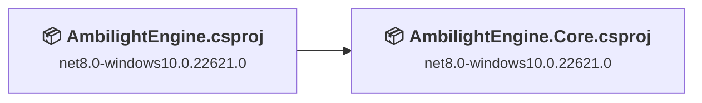
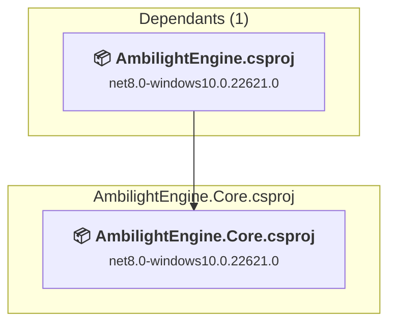
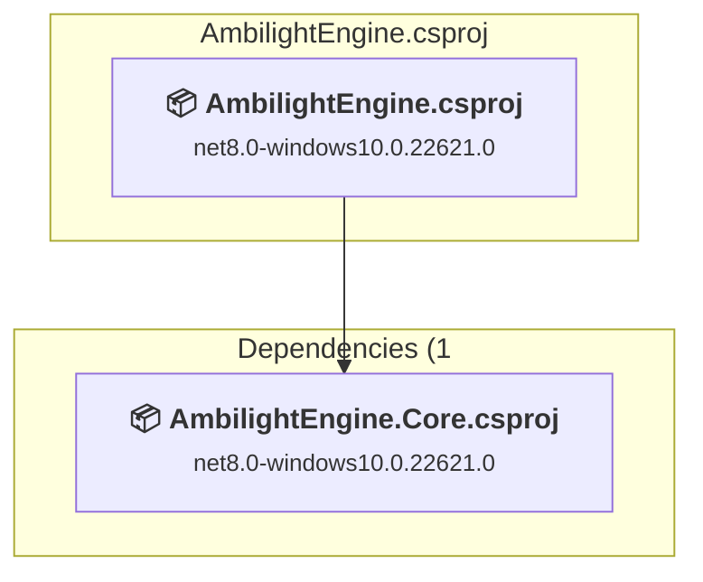

# Projects and dependencies analysis

This document provides a comprehensive overview of the projects and their dependencies in the context of upgrading to .NETCoreApp,Version=v10.0.

## Table of Contents

- [Executive Summary](#executive-Summary)
  - [Highlevel Metrics](#highlevel-metrics)
  - [Projects Compatibility](#projects-compatibility)
  - [Package Compatibility](#package-compatibility)
  - [API Compatibility](#api-compatibility)
  - [Binding Redirect Configuration](#binding-redirect-configuration)
- [Aggregate NuGet packages details](#aggregate-nuget-packages-details)
- [Top API Migration Challenges](#top-api-migration-challenges)
  - [Technologies and Features](#technologies-and-features)
  - [Most Frequent API Issues](#most-frequent-api-issues)
- [Projects Relationship Graph](#projects-relationship-graph)
- [Project Details](#project-details)

  - [AmbilightEngine.Core\AmbilightEngine.Core.csproj](#ambilightenginecoreambilightenginecorecsproj)
  - [AmbilightEngine\AmbilightEngine.csproj](#ambilightengineambilightenginecsproj)

## Executive Summary

### Highlevel Metrics

| Metric | Count | Status |
| :--- | :---: | :--- |
| Total Projects | 2 | All require upgrade |
| Total NuGet Packages | 10 | 4 need upgrade |
| Total Code Files | 59 |  |
| Total Code Files with Incidents | 38 |  |
| Total Lines of Code | 13155 |  |
| Total Number of Issues | 650 |  |
| Estimated LOC to modify | 644+ | at least 4,9% of codebase |

### Projects Compatibility

| Project | Target Framework | Difficulty | Package Issues | API Issues | Binding Issues | Est. LOC Impact | Description |
| :--- | :---: | :---: | :---: | :---: | :---: | :---: | :--- |
| [AmbilightEngine.Core\AmbilightEngine.Core.csproj](#ambilightenginecoreambilightenginecorecsproj) | net8.0-windows10.0.22621.0 | 🟢 Low | 1 | 72 | 0 | 72+ | ClassLibrary, Sdk Style = True |
| [AmbilightEngine\AmbilightEngine.csproj](#ambilightengineambilightenginecsproj) | net8.0-windows10.0.22621.0 | 🟢 Low | 3 | 572 | 0 | 572+ | WinForms, Sdk Style = True |

### Package Compatibility

| Status | Count | Percentage |
| :--- | :---: | :---: |
| ✅ Compatible | 6 | 60,0% |
| ⚠️ Incompatible | 1 | 10,0% |
| 🔄 Upgrade Recommended | 3 | 30,0% |
| ***Total NuGet Packages*** | ***10*** | ***100%*** |

### API Compatibility

| Category | Count | Impact |
| :--- | :---: | :--- |
| 🔴 Binary Incompatible | 0 | High - Require code changes |
| 🟡 Source Incompatible | 582 | Medium - Needs re-compilation and potential conflicting API error fixing |
| 🔵 Behavioral change | 62 | Low - Behavioral changes that may require testing at runtime |
| ✅ Compatible | 19727 |  |
| ***Total APIs Analyzed*** | ***20371*** |  |

## Aggregate NuGet packages details

| Package | Current Version | Suggested Version | Projects | Description |
| :--- | :---: | :---: | :--- | :--- |
| H.NotifyIcon.WinUI | 2.0.115 |  | [AmbilightEngine.csproj](#ambilightengineambilightenginecsproj) | ⚠️Pakiet NuGet jest niezgodny |
| MaterialColorUtilities | 0.3.0 |  | [AmbilightEngine.csproj](#ambilightengineambilightenginecsproj) | ✅Compatible |
| Microsoft.Win32.SystemEvents | 8.0.0 | 10.0.11 | [AmbilightEngine.Core.csproj](#ambilightenginecoreambilightenginecorecsproj) | Rekomendowane jest uaktualnienie pakietu NuGet |
| Microsoft.Windows.SDK.BuildTools | 10.0.28000.2270 |  | [AmbilightEngine.csproj](#ambilightengineambilightenginecsproj) | ✅Compatible |
| Microsoft.WindowsAppSDK | 2.3.1 |  | [AmbilightEngine.csproj](#ambilightengineambilightenginecsproj) | ✅Compatible |
| MQTTnet | 5.0.1.1416 |  | [AmbilightEngine.csproj](#ambilightengineambilightenginecsproj) | ✅Compatible |
| System.Collections.Immutable | 8.0.0 | 10.0.11 | [AmbilightEngine.csproj](#ambilightengineambilightenginecsproj) | Rekomendowane jest uaktualnienie pakietu NuGet |
| System.Reflection.Metadata | 8.0.0 | 10.0.11 | [AmbilightEngine.csproj](#ambilightengineambilightenginecsproj) | Rekomendowane jest uaktualnienie pakietu NuGet |
| Vortice.Direct3D11 | * |  | [AmbilightEngine.Core.csproj](#ambilightenginecoreambilightenginecorecsproj) | ✅Compatible |
| Vortice.DXGI | * |  | [AmbilightEngine.Core.csproj](#ambilightenginecoreambilightenginecorecsproj) | ✅Compatible |

## Top API Migration Challenges

### Technologies and Features

| Technology | Issues | Percentage | Migration Path |
| :--- | :---: | :---: | :--- |
| GDI+ / System.Drawing | 2 | 0,3% | System.Drawing APIs for 2D graphics, imaging, and printing that are available via NuGet package System.Drawing.Common. Note: Not recommended for server scenarios due to Windows dependencies; consider cross-platform alternatives like SkiaSharp or ImageSharp for new code. |

### Most Frequent API Issues

| API | Count | Percentage | Category |
| :--- | :---: | :---: | :--- |
| T:Windows.UI.Color | 313 | 48,6% | Source Incompatible |
| M:Windows.UI.Color.FromArgb(System.Byte,System.Byte,System.Byte,System.Byte) | 67 | 10,4% | Source Incompatible |
| T:Windows.Foundation.Point | 36 | 5,6% | Source Incompatible |
| P:Windows.UI.Color.B | 31 | 4,8% | Source Incompatible |
| P:Windows.UI.Color.G | 31 | 4,8% | Source Incompatible |
| P:Windows.UI.Color.R | 31 | 4,8% | Source Incompatible |
| T:System.Uri | 23 | 3,6% | Behavioral Change |
| M:System.Uri.#ctor(System.String) | 19 | 3,0% | Behavioral Change |
| M:System.TimeSpan.FromMilliseconds(System.Double) | 13 | 2,0% | Source Incompatible |
| T:System.Text.Json.JsonDocument | 10 | 1,6% | Behavioral Change |
| T:System.Net.Http.HttpContent | 9 | 1,4% | Behavioral Change |
| M:System.TimeSpan.FromSeconds(System.Double) | 7 | 1,1% | Source Incompatible |
| T:Microsoft.Win32.PowerModes | 7 | 1,1% | Source Incompatible |
| T:Microsoft.Win32.SessionSwitchReason | 7 | 1,1% | Source Incompatible |
| T:Microsoft.Win32.PowerModeChangedEventHandler | 6 | 0,9% | Source Incompatible |
| T:Microsoft.Win32.SessionSwitchEventHandler | 6 | 0,9% | Source Incompatible |
| P:Windows.UI.Color.A | 4 | 0,6% | Source Incompatible |
| E:Microsoft.Win32.SystemEvents.PowerModeChanged | 3 | 0,5% | Source Incompatible |
| E:Microsoft.Win32.SystemEvents.SessionSwitch | 3 | 0,5% | Source Incompatible |
| P:Microsoft.Win32.PowerModeChangedEventArgs.Mode | 3 | 0,5% | Source Incompatible |
| P:Microsoft.Win32.SessionSwitchEventArgs.Reason | 3 | 0,5% | Source Incompatible |
| M:Windows.Foundation.Point.#ctor(System.Double,System.Double) | 3 | 0,5% | Source Incompatible |
| T:System.Drawing.Icon | 2 | 0,3% | Source Incompatible |
| T:Microsoft.Win32.PowerModeChangedEventArgs | 1 | 0,2% | Source Incompatible |
| F:Microsoft.Win32.PowerModes.Resume | 1 | 0,2% | Source Incompatible |
| F:Microsoft.Win32.PowerModes.Suspend | 1 | 0,2% | Source Incompatible |
| T:Microsoft.Win32.SessionSwitchEventArgs | 1 | 0,2% | Source Incompatible |
| F:Microsoft.Win32.SessionSwitchReason.SessionUnlock | 1 | 0,2% | Source Incompatible |
| F:Microsoft.Win32.SessionSwitchReason.SessionLock | 1 | 0,2% | Source Incompatible |
| M:System.Environment.SetEnvironmentVariable(System.String,System.String) | 1 | 0,2% | Behavioral Change |

## Projects Relationship Graph

Legend:
📦 SDK-style project
⚙️ Classic project

## Project Details

### AmbilightEngine.Core\AmbilightEngine.Core.csproj

#### Project Info

- **Current Target Framework:** net8.0-windows10.0.22621.0
- **Proposed Target Framework:** net10.0--windows10.0.22621.0
- **SDK-style**: True
- **Project Kind:** ClassLibrary
- **Dependencies**: 0
- **Dependants**: 1
- **Number of Files**: 31
- **Number of Files with Incidents**: 7
- **Lines of Code**: 5590
- **Estimated LOC to modify**: 72+ (at least 1,3% of the project)

#### Dependency Graph

Legend:
📦 SDK-style project
⚙️ Classic project

### API Compatibility

| Category | Count | Impact |
| :--- | :---: | :--- |
| 🔴 Binary Incompatible | 0 | High - Require code changes |
| 🟡 Source Incompatible | 57 | Medium - Needs re-compilation and potential conflicting API error fixing |
| 🔵 Behavioral change | 15 | Low - Behavioral changes that may require testing at runtime |
| ✅ Compatible | 4904 |  |
| ***Total APIs Analyzed*** | ***4976*** |  |

### AmbilightEngine\AmbilightEngine.csproj

#### Project Info

- **Current Target Framework:** net8.0-windows10.0.22621.0
- **Proposed Target Framework:** net10.0-windows10.0.22621.0
- **SDK-style**: True
- **Project Kind:** WinForms
- **Dependencies**: 1
- **Dependants**: 0
- **Number of Files**: 50
- **Number of Files with Incidents**: 31
- **Lines of Code**: 7565
- **Estimated LOC to modify**: 572+ (at least 7,6% of the project)

#### Dependency Graph

Legend:
📦 SDK-style project
⚙️ Classic project

### API Compatibility

| Category | Count | Impact |
| :--- | :---: | :--- |
| 🔴 Binary Incompatible | 0 | High - Require code changes |
| 🟡 Source Incompatible | 525 | Medium - Needs re-compilation and potential conflicting API error fixing |
| 🔵 Behavioral change | 47 | Low - Behavioral changes that may require testing at runtime |
| ✅ Compatible | 14823 |  |
| ***Total APIs Analyzed*** | ***15395*** |  |

#### Project Technologies and Features

| Technology | Issues | Percentage | Migration Path |
| :--- | :---: | :---: | :--- |
| GDI+ / System.Drawing | 2 | 0,3% | System.Drawing APIs for 2D graphics, imaging, and printing that are available via NuGet package System.Drawing.Common. Note: Not recommended for server scenarios due to Windows dependencies; consider cross-platform alternatives like SkiaSharp or ImageSharp for new code. |

